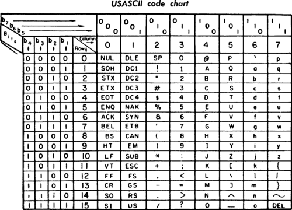
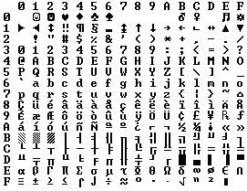

我在翻 Java 书的时候，看到 *Unicode 和 char 类型*章节，兴许是翻译的问题，看的不是很明白，而且编程中经常会遇到 Unicode、UTF-8和UTF-16 这些术语或是编码格式，于是我查找了一些资料，整理出这篇文章。

非常推荐你阅读[参考文档 1](#参考文档)，本篇文章对其作了补充。

按照时间顺序能介绍的更清楚一些。

## 01 ASCII

[ASCII](https://en.wikipedia.org/wiki/ASCII)字符编码标准在1963年第一次正式发布，时间早于 Unix 和 C语言，其字符集包括早期的非重音的英文字母和常用符号（可以观察下你的键盘），ASCII 使用32到127（`0x20~0xFF`）的序号来表示这些字母，比如空格为32，字母“A”为65（`0x41`）。



这些字符用7位（7-bits）即能绰绰有余的表示（2的7次方是128），而计算机通常以字节（Byte）作为基本单元，每字节有8位，所以这样会多出一整位，实际点说是还有128个位置是空闲的（从128～255），使用者可以根据自己需要再插入其它字符。比如，IBM-PC 使用的  OEM 字符集（Original Equipment Manufacturer），它为欧洲语言提供了一些重音字符和一堆画线字符……水平条、垂直条、带有小叮当悬挂在右侧的水平条（用于在 DOS 时代绘制表格）。



ASCII保留了前32个字符，这些字符被称为控制字符（`Control Characters`，或`Unprintable`），最初的目的不是表示可打印信息，而是用于控制使用 ASCII 的设备（例如打印机），或提供有关数据流（例如存储在磁带上的数据流）的元信息。例如，字符 10 代表“换行（line feed）”功能，字符 8 代表“退格（backspace）”。

## 02 ANSI/OEM
因为人们可以自由定义 ASCII 中大于序号127的128个字符，可预见地这会带来使用时的混乱。事实上，只要是在美国之外的人们购买的 PC，就会遇到各种各样不同的 OEM 字符集，这些字符集一致地使用后面空闲的128个字符位置。比如，130号字符在一些 PC 上是 é，但在*以色列*的电脑上可能就是希伯来语字母 ג（Hebrew letter Gimel (ג)），在中国的电脑上是什么也不得而知（我找了 OEM 936，不过并没找到😢）。想象下美国人发给国外的一封邮件，其中有个单词是 résumés，在以色列它是 rגsumגs，在中国可能是 r�sum�s，你自己便能感觉出来，这很奇怪！

最终，这些自由使用的 OEM 编入了 ANSI 标准（American National Standards Institute）。在该标准中，前128个字符与 ASCII 保持一致，而后128个字符会根据所在地的不同采用不同的处理方式，这种处理不同的系统称为 *code page*（码页），比如在以色列使用的码页是862，希腊使用的737，中国使用的是936（CP936，简体中文）。

操作系统会保留很多的码页，并根据地区的不同改变所使用的码页，以实现语言本地化。但这种方式只解决了一部分的问题，希伯来语很难通过这种方式轻易地转化为希腊语。在亚洲，我们使用的字符有几万种之多，128个空闲位显然是不够的，这个问题通过一个混乱的 DBCS（Double Byte Char Set）系统解决，但使用非常不方便。

## 03 Unicode
Unicode 的目的是创建一套包含世界上绝大多数书写符号的单一字符集，正如其口号“让世界上的每一个人都能在手机和电脑上使用他们自己的语言（Everyone in the world should be able to use their own language on phones and computers）”。

Unicode中的每个符号均被赋予了一个特别的序号，称为**码点**（code point）。以“中”字为例，其被表示称“U+4E2D”，“U+”代表Unicode，后面跟着的是一个十六进制的数字。在[Unicode Utilities: Character Properties](https://util.unicode.org/UnicodeJsps/character.jsp)中，可以搜索到所有 Unicode 字符。

人们对 Unicode 经常有这样的误解：Unicode 都是使用16 位编码，每个字符占用 16 位，因此有 65536 个可能的字符。这是不对的，或者说是没有关联的。因为 Unicode 是一种字符标准，是一套字符集，而确定 Unicode 字符占用多少位是编码标准来决定的，比如常见的编码标准 UTF-8、UTF-16 和 UTF-32 等等。

以英文字母“A”为例，使用 UTF-8 存储是 0x41；使用UTF-16 存储是 0x0041；使用UTF-32 存储就是 0x00000041。Unicode 能定义的字符数是没有限制的，目前 Unicode 中的字符数已经超过65536个，所以并不是每个 Unicode 字符都能被保存到2个字节里，即用16位表示。比如表情符号（emoji）一般会超过16位，如😆（U+1F606）。

## 04 Encoding
假如现在我们有一个字符串：“**Hello 红🐸**”。

在 Unicode 中其对应8个码点：
```
H	   e	  l 	 l 		o 	   SPACE  红 	 🐸
U+0048 U+0065 U+006C U+006C U+006F U+0020 U+7EA2 U+1F438
```

现在我们来考虑常见的编码方案。下面中的 UTF-x 为 x-bits Unicode Transformation Format。

### 4.1 UTF-16
对 Unicode 字符编码最传统的方式是使用 UTF-16，对于上面的字符串，可以编码为：
```
H     e     l     l     o     SPACE 红    🐸
00 48 00 65 00 6C 00 6C 00 6F 00 20 7E A2 ?
```

我们暂时先不考虑最后一个字符，对前面的字符串我们可以这样编码：
```
00 48 00 65 00 6C 00 6C 00 6F 00 20 7E A2
```

但是，是不是还可以这样：
```
48 00 65 00 6C 00 6C 00 6F 00 20 00 A2 7E
```

你注意到这里涉及到一个**字节序**（Byte Order）的概念，其有2种，分别为**高字节序**（high-endian）和**低字节序**（low-endian）。使用 UTF-16 编码方案时，一般会在文本开头使用2字节作为标记位，如 FE FF 或是 FF FE。

现在考虑最后一个字符🐸（U+1F438）如何编码。

事实上，每个 Unicode 码点总是被编码为1或2个16位码元。前面遇到字符都只编码为1个码元，其码点范围为 U+0000 ~ U+D7FF 和 U+E000 ~ U+FFFF，此时编码的值与码点值对应。对范围在 U+010000 ~ U+10FFFF 的 Unicode 字符，将会编码为2个16位码元，采用如下编码策略：

假设原始 Unicode 字符为 U：
$$1)\qquad U' = U - 0x010000 = 0b \underbrace{yyyyyyyyyyy}_{10} \underbrace{xxxxxxxxxx}_{10}$$
$$2)\qquad W1 = 110110yyyyyyyyyy = 0xD800 + yyyyyyyyyy$$
$$3)\qquad W2 = 110111xxxxxxxxxx = 0xDC00 + xxxxxxxxxx$$

W1 和 W2 即为得到的2个新码元。

我们以🐸（U+1F438）为例，$$U' = 0xF438 = 0b0000\_1111\_01|00\_0011\_1000$$

以10位截断后
$$W1 = 0b1101\_1000\_0011\_1101 = 0xD83D$$
$$W2 = 0b1101\_1100\_0011\_1000 = 0xDC38$$

最后可编码为：`D8 3D DC 38` 或`DC 38 D8 3D`。

你可能会疑问 U+D8000 ~ U+DFFF 的字符去哪儿了？事实上，这个范围是 Unicode 委员会的永久保留空位，因此，不会上面的编码方案不会存在冲突的情况。在解码时，只需查看每个码元的前6位即可确定当前字符是占用1个还是2个码元。

另外，使用 UTF-16 编码方案的有 Microsoft Windows API，Java 和 JavaScript等。

### 4.2 UTF-8
对于使用英语做为母语的国家，如英国和美国，使用 UTF-16 会产生很多无用的0（基本上一半都是0），这自然造成了网络传输或存储时的资源浪费，为此，人们提出了 UTF-8 方案。

| Code Point | Byte1 | Byte2 | Byte3 | Byte4 |
| ---------- | ----- |------ | ----- | ----- |
| U+0000~U+007F | 0xxxxxxx | \ | \ | \ |
| U+0080~U+07FF | 110xxxxx | 10xxxxxx | \ | \ |
| U+0800~U+FFFF | 1110xxxx | 10xxxxxx | 10xxxxxx | \ |
| U+10000~U10FFFF | 11110xxx | 10xxxxxx | 10xxxxxx | 10xxxxxx |

对码点小于 0x7F 的 Unicode 字符，与编码 ASCII 字符没有任何区别，对 U+0080 往上的字符，使用 UTF-8 最多占用4个字节。

我们依然以之前的字符串为例，
```
H     e     l     l     o     SPACE
0x48  0x65  0x6C  0x6C  0x6F  0x20

7EA2(红) = 0111_1110_1010_0010
UTF-8: 11100111_10111010_10100010 = 0xE7 0xBA 0xA2

1F438(🐸) = 0_0001_1111_0100_0011_1000
UTF-8: 11110000_10011111_10010000_10111000 = 0xF0 0x9F 0x90 0xB8
```

你会注意到，使用 UTF-8 编码一个中文字符一般会花费3个字节，而使用 UTF-16 则基本上会是2个字节，所以相比 UTF-16，UTF-8 编码中文字符资源利用率更低。同时，网络浏览器中基本都是使用 UTF-8。

### 4.3 UTF-32
UTF-32 编解码方式非常简单，但也造成了极大的资源浪费。我们同样以之前的字符串为例：
```
H           e           l           l           o
00 00 00 48 00 00 00 65 00 00 00 6C 00 00 00 6C 00 00 00 6F 
SPACE       红          🐸
00 00 00 20 00 00 7E A2 00 01 F4 38
```

## 05 小节
这篇文章介绍了常见的字符标准（字符集），以及使用 Unicode 时的常用编码方案。

## 参考文档
- https://www.joelonsoftware.com/2003/10/08/the-absolute-minimum-every-software-developer-absolutely-positively-must-know-about-unicode-and-character-sets-no-excuses/
- https://stackoverflow.com/questions/2241348/what-are-unicode-utf-8-and-utf-16
- https://en.wikipedia.org/wiki/UTF-16
- https://en.wikipedia.org/wiki/ASCII
- https://www.cnblogs.com/myd620/p/8981569.html

